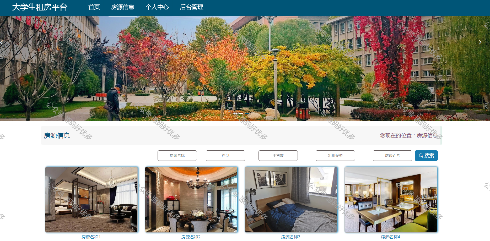
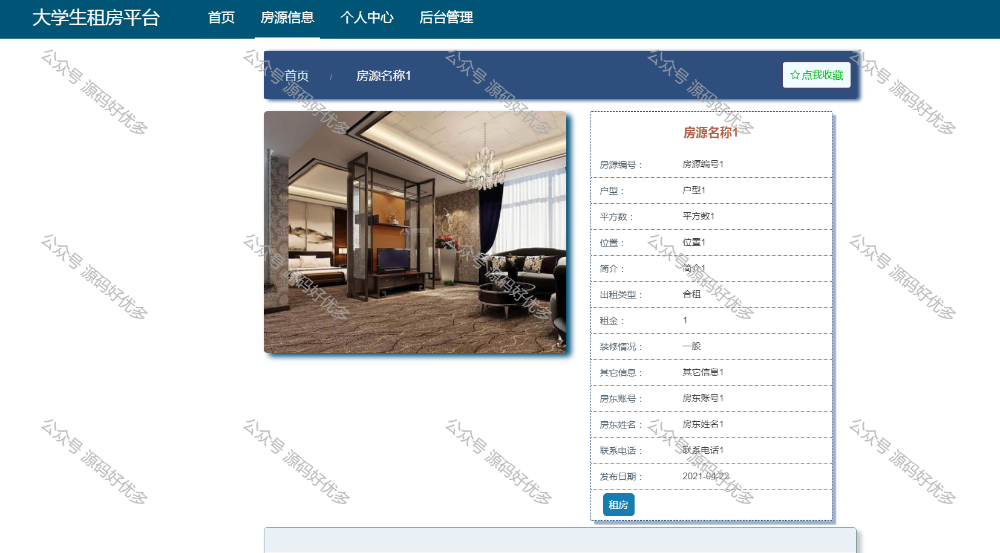
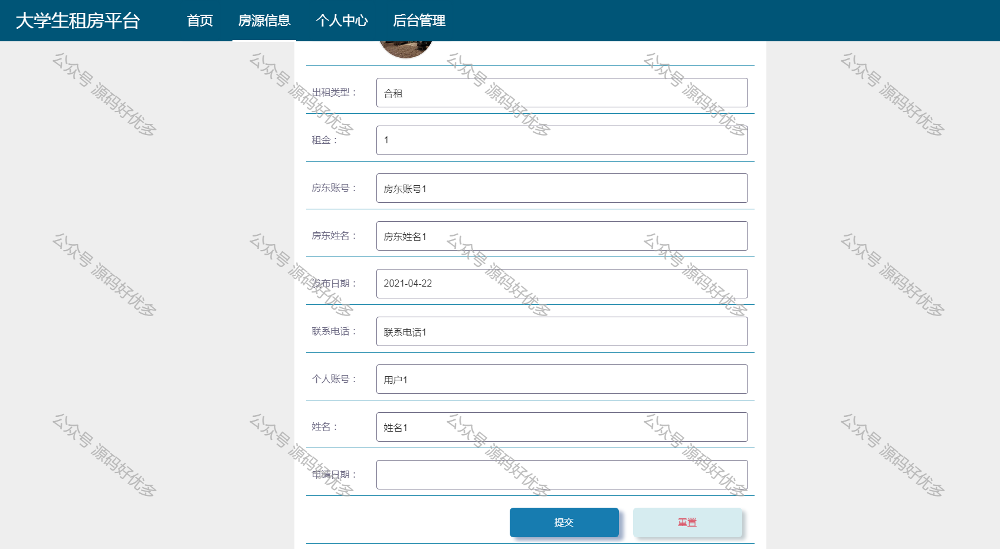
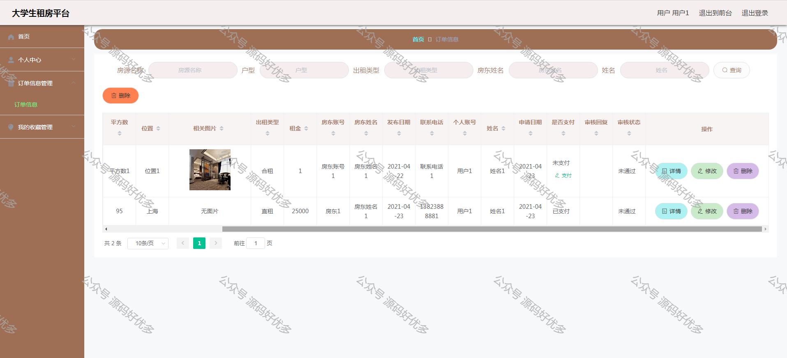
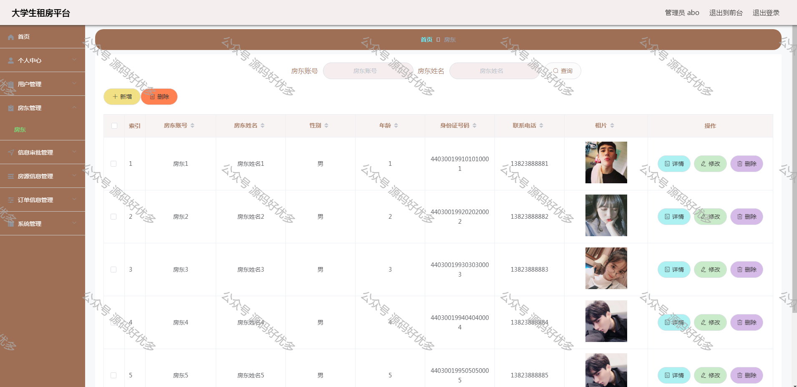
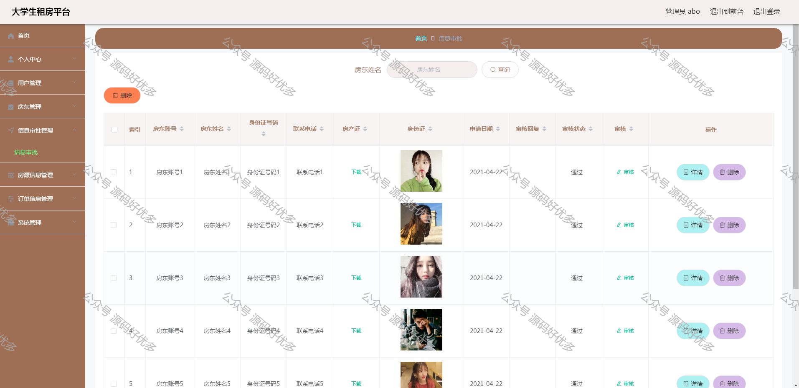
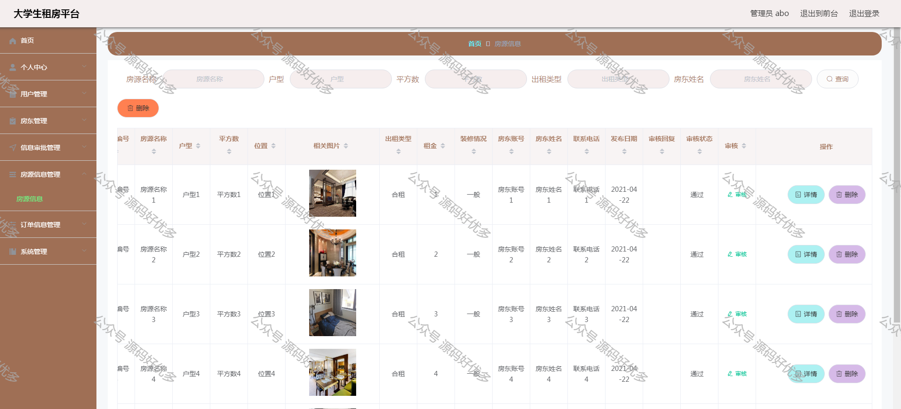
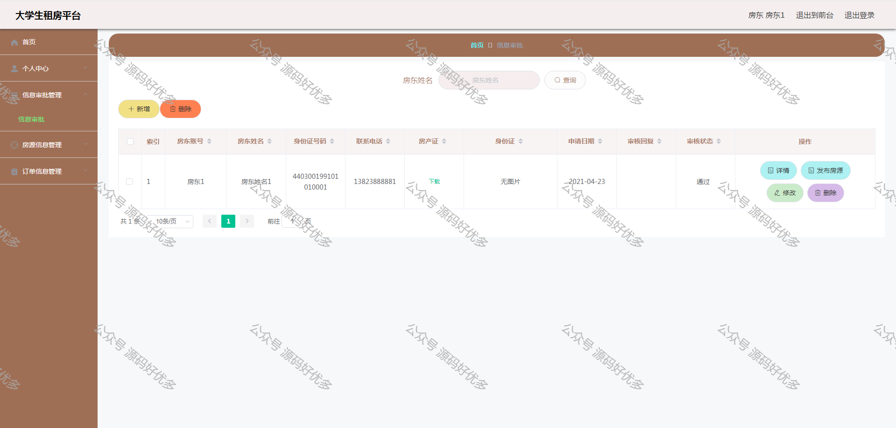

 
## 查看主页获取源码

> **作者介绍**： **✌**全网粉丝10W+本平台特邀作者、博客专家、CSDN新星计划导师、java领域优质创作者,博客之星、掘金/华为云/阿里云/InfoQ等平台优质作者、专注于毕业项目实战 **✌**

  

### 一、作品包含

源码+数据库+设计文档万字LW+PPT+全套环境和工具资源+部署教程

### 二、项目技术

前端技术：Html、Css、Js、Vue、Element-ui

数据库：MySQL

后端技术：Java、Spring Boot、MyBatis

  

### 三、运行环境

开发工具：IDEA/eclipse

数据库：MySQL8.0

数据库管理工具：Navicat10以上版本

环境配置软件： JDK1.8+Maven3.6.3

前端Nodejs：14

  

### 四、项目介绍

项目编号：springboot007

互联网发展至今，无论是其理论还是技术都已经成熟，而且它广泛参与在社会中的方方面面。它让信息都可以通过网络传播，搭配信息管理工具可以很好地为人们提供服务。针对大学生租房信息管理混乱，出错率高，信息安全性差，劳动强度大，费时费力等问题，采用大学生租房平台可以有效管理，使信息管理能够更加科学和规范。
大学生租房平台使用Java语言进行编码，使用Mysql创建数据表保存本系统产生的数据。系统可以提供信息显示和相应服务，其管理员管理房东和用户，对房东提交的信息审批信息进行审核，审核房东发布的房源信息。房东提交信息审批信息，发布房源信息，审核用户租房订单。用户收藏房屋，租用房屋，支付租房订单。
总之，大学生租房平台集中管理信息，有着保密性强，效率高，存储空间大，成本低等诸多优点。它可以降低信息管理成本，实现信息管理计算机化。

### 五、运行截图

  
